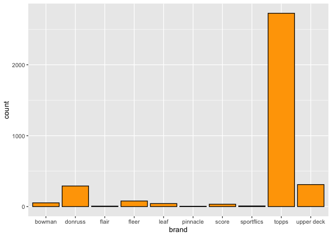

Analysis of Baseball Cards
================

``` r
library(tidyverse)
library(lubridate)
```

``` r
# Loop through team files to get data file paths
my_files <- list.files(path=here::here("card_data/"), pattern="*.csv", full.names = TRUE)

# Read in files with the tidyverse, removing rows with all NA, and correcting a typo
card_data <- read_csv(my_files, na = c("", "NA", "none")) %>% 
  filter_all(any_vars(complete.cases(.))) %>% 
  mutate(
    brand = case_when(
      brand == "sportflicx" ~ "sportflics",
      brand == 'sportflix' ~ 'sportflics',
      TRUE ~ brand
    )
  )
```

``` r
card_data %>% 
  ggplot(aes(x = brand)) +
  geom_bar(color = "black", fill = "orange")
```

<!-- -->
